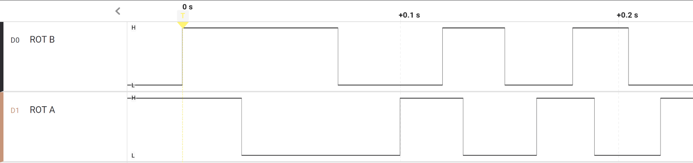
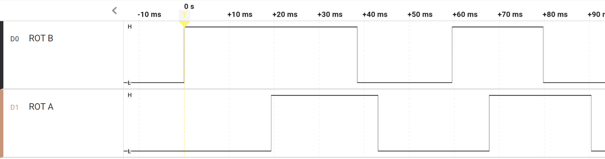
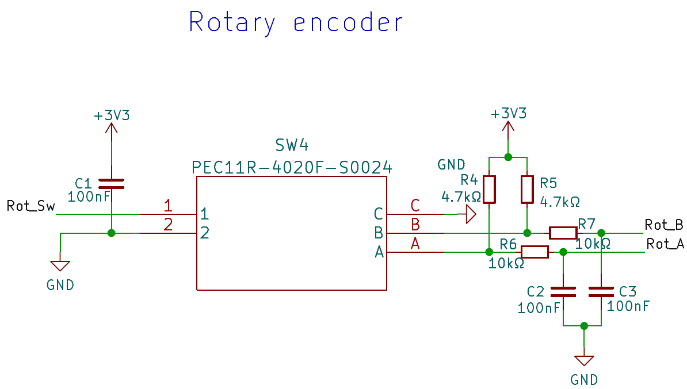

# GPIO interrupts

**GPIO** **insterrupts**

RP2040 has two GPIO banks that can trigger interrupts. Second GPIO bank
is dedicated to external flash interface so user programs can use only
GPIO bank 0. Each pin in the bank can be programmed to trigger an
interrupt on HIGH/LOW level of rising or falling edge. It is possible to
configure more than one trigger per pin but the most common case is to
configure only one type of trigger.

Study
[<u>https://www.raspberrypi.com/documentation/pico-sdk/hardware.html#hardware_gpio</u>.](https://www.raspberrypi.com/documentation/pico-sdk/hardware.html#hardware_gpio)
Pay attention to assigning callbacks to GPIO pins.

Rotary encoder has two
outputs that change their state when the encoder is turned. The outputs
are typically named A and B. The encoder is built so that only one of
the

outputs changes at a time when the shaft is turned. Depending on the
rotation either A or B makes contact first. To decode direction of turn
we can choose one of the signals as clock and monitor the change of the
other on one edge of the clock.

For example, if we choose A as the clock, we check the state of B on
every rising edge of A. To ensure that we don’t miss any of the edges
we’ll configure an interrupt on the rising edge of the pin A is wired
to.

Shaft is turned clockwise→B
is low on rising edge of A

Shaft is turned
counter-clockwise: B is high on rising edge of A

Rot_Sw has no pull-up so we
need to enable

built-in pull-up

Rot_A and Rot_B have external pull-ups so they are configured as
ordinary

inputs

> The rotary encoder is connected to three GPIO pins:
>
> • Rot_A to 10 – configure as an input **without** pull-up/pull-down •
> Rot_B to 11 – configure as an input **without** pull-up/pull-down •
> Rot_Sw to 12 – configure as an input **with** pull-up

**Exercise** **1** **–** **Dimmer** **with** **a** **rotary**
**encoder**

Implement a program for switching LEDs on/off and dimming them. The
program should work as follows:

> • Rot_Sw, the push button on the rotary encoder shaft is the on/off
> button. When button is pressed the state of LEDs is toggled. Program
> must require the button to be released before the LEDs toggle again.
> Holding the button may not cause LEDs to toggle multiple times.
>
> • Rotary encoder is used to control brightness of the LEDs. Turning
> the knob clockwise increases brightness and turning counter-clockwise
> reduces brightness. If LEDs are in OFF state turning the knob has no
> effect.
>
> • When LED state is toggled to ON the program must use same brightness
> of the LEDs they were at when they were switched off. If LEDs are ON
> and dimmed to 0% then pressing the button will set 50% brightness
> immediately.
>
> • PWM frequency divider must be configured to output 1 MHz frequency
> and PWM frequency must be 1 kHz.

You must use GPIO interrupts for detecting the encoder turns.